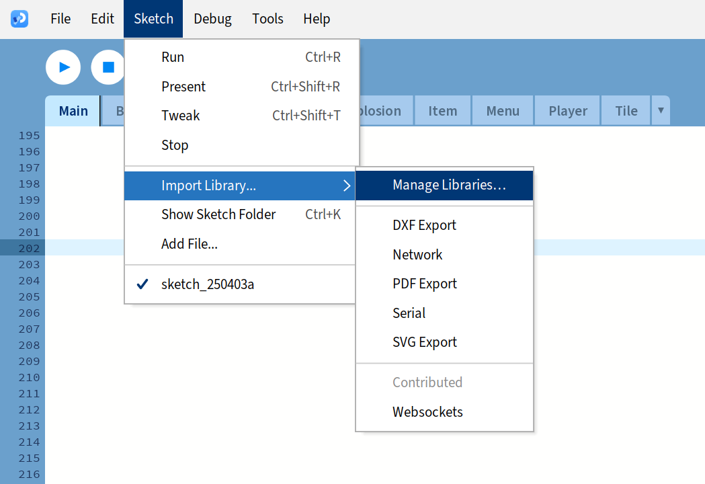
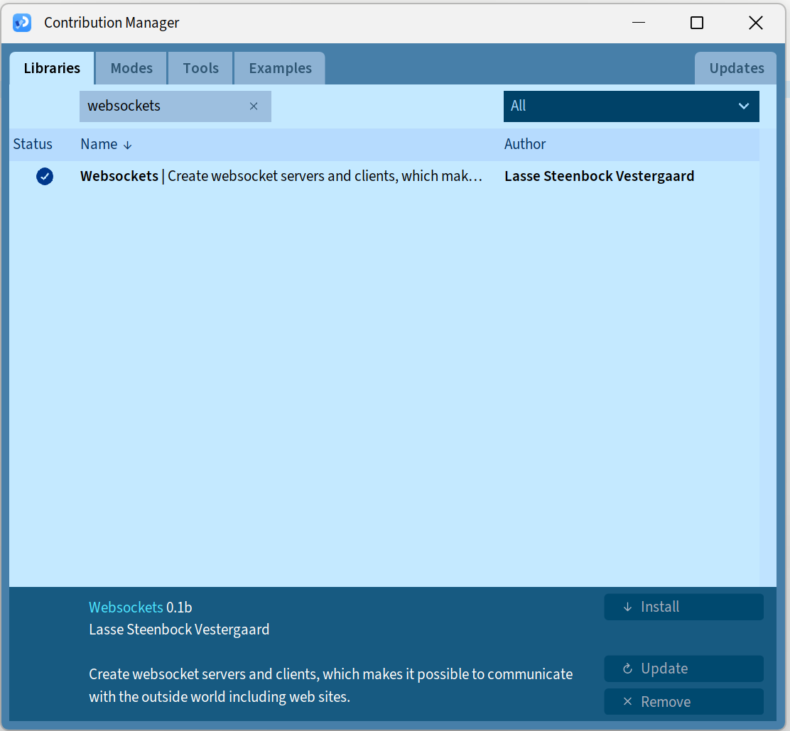

# Bomberman Game

## Overview
This game is a simplified version of the classic Bomberman game, where the player controls a character 
in a grid-based environment filled with walls, breakable blocks, bombs, explosions, enemies, and items.
The goal of the game is to destroy breakable blocks and enemies using bombs while avoiding explosions and 
managing power-ups. The player can place bombs, which will explode after a short delay, clearing obstacles 
and damaging enemies within the blast radius.

## Features
- **Grid-based map** with walls, breakable blocks, and grass.
- **Player movement**: The player can move around the grid and place bombs.
- **Bombs**: The player can place bombs, and after a countdown, they explode, clearing blocks and damaging enemies.
- **Explosions**: Explosions propagate in all directions, affecting the surrounding tiles.
- **Enemies**: Enemies appear on the map and are destroyed by explosions.
- **Items**: Various power-ups, such as bomb range increases and speed boosts, are scattered around the map.

The game includes a main menu where the player can start a new game, resume a paused game, or exit.
The game also supports WebSocket communication for potential multiplayer features or other integrations.


## Technologies Used
- **Java**: The game is implemented in Java using Processing for graphics rendering.
- **Voice commands**: The game is using websocket to listen for the voice inputs
- **Tile-based Logic**: The game world is represented as a grid of tiles, each with a specific function or behavior.

## Getting Started

### Prerequisites
Before you begin, make sure you have the following installed:
- [Processing IDE](https://processing.org/download/): Used to develop and run the game.
- Java (JDK): Make sure Java is installed on your system.
- [WebSockets for Processing (Library)](https://github.com/alexandrainst/processing_websockets)


### Installation
1. Clone the repository to your local machine:
   ```bash
   git clone https://github.com/your-username/tile-based-game.git
2. Open the project in the Processing IDE.
3. Load the websocket library

#### Websocket Instruction
Since, I have already included the library in my project, there is no need to download it. Just follow the instruction bellow:
1. Opne Processing IDE
2. From the menu go to sketch > Import Library > Manage Library

3. Search for `websocket` and install it



3. Run the game by selecting the Run button in Processing.

### Controls
- Arrow keys: Move the player around the game world.

- Spacebar: Place bombs to destroy breakable blocks.

- Collect items: Walk over power-ups to collect them.


### Game Mechanics
#### Tiles
- The game world is made up of different types of tiles:

- Wall: A solid block that the player cannot move through.

- Grass: A passable tile that does not interact with the player.

- Breakable Block: A tile that can be destroyed by the player’s bomb, potentially revealing hidden items.


#### Items
- There are two types of items that the player can collect:

- BombPower: Increases the player's bomb power.

- Speed: Increases the player's movement speed.


#### Enemies
Currently, moves randomly since the algorithm is not complete and working on it, but it will be enhanced in the future to include pathfinding algorithms for better movement.
